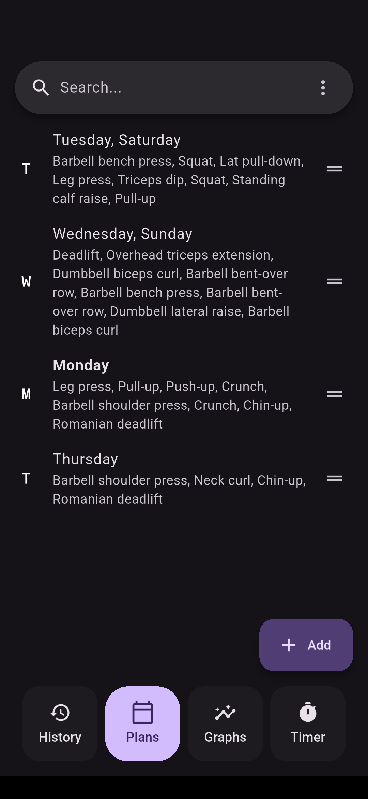
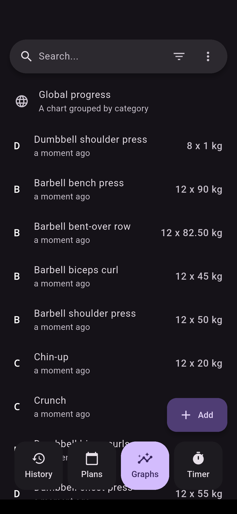
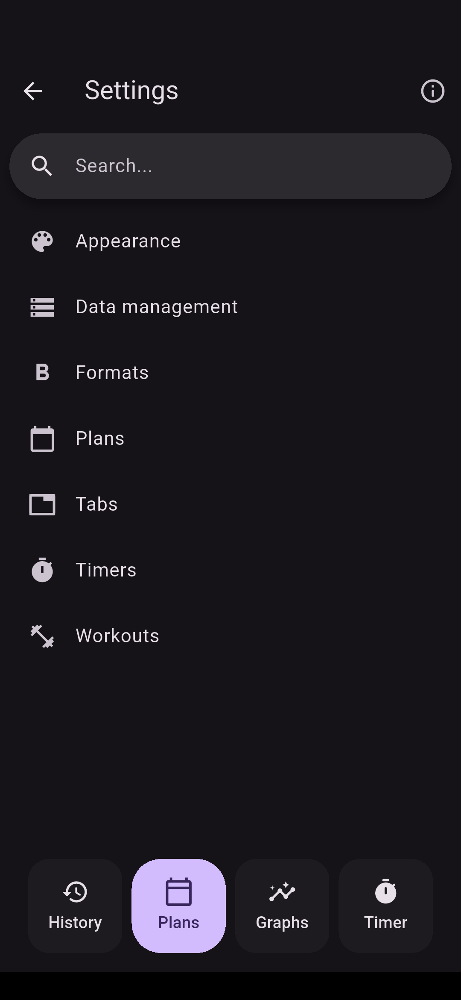
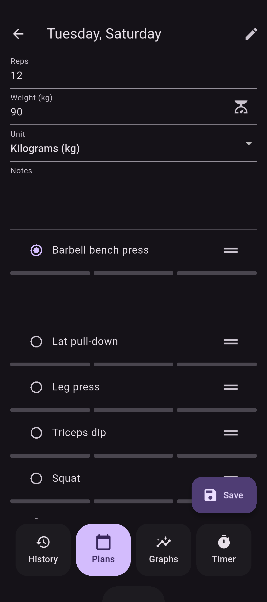
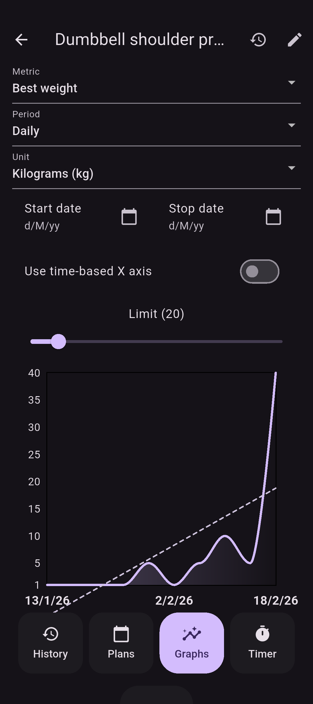
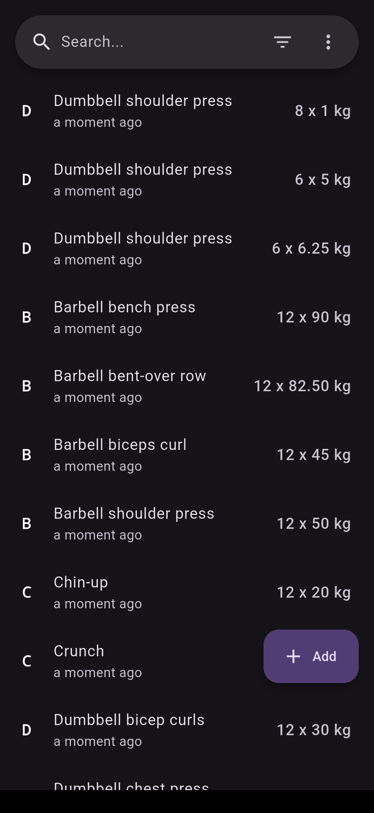
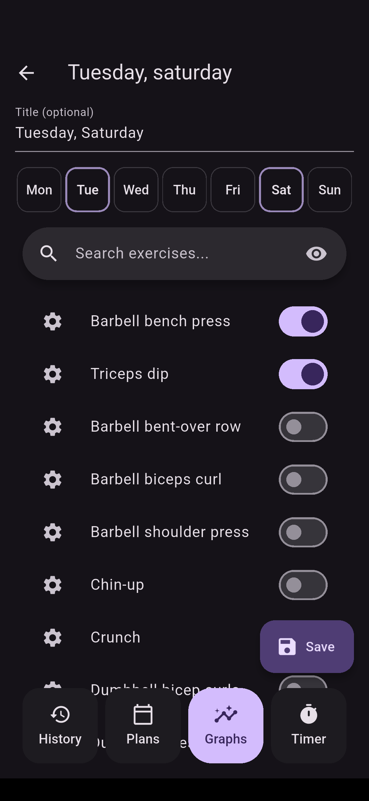
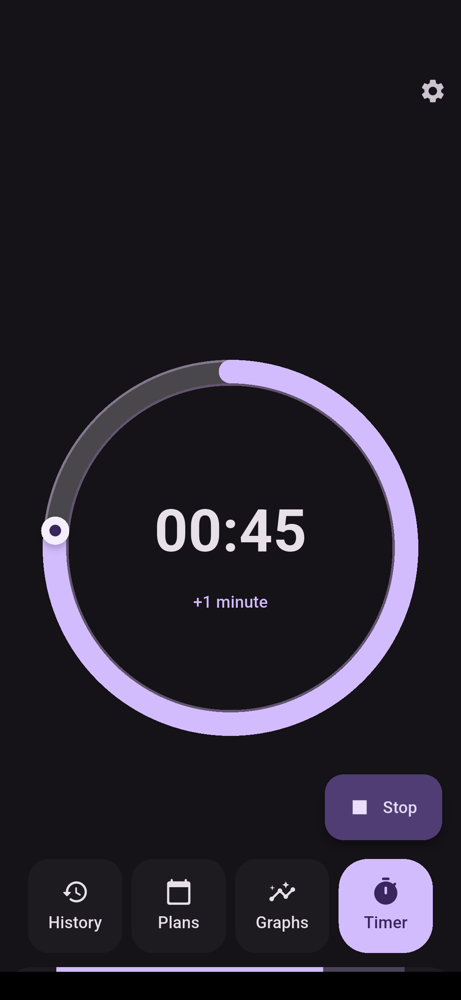
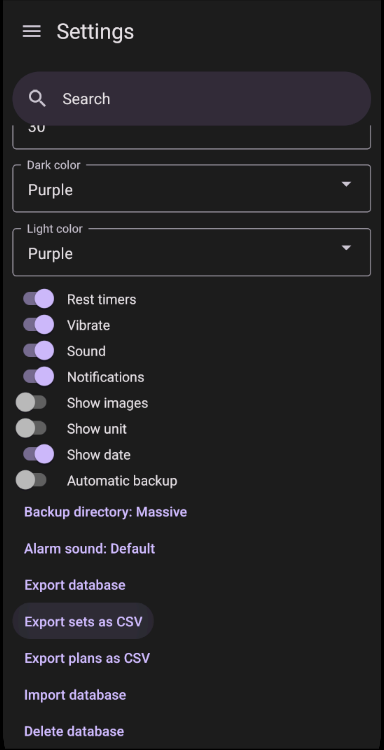
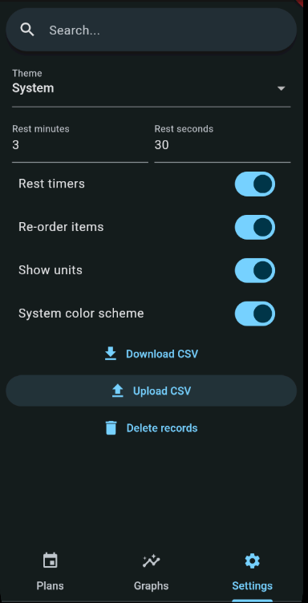

# Flexify

Get fit with Flexify. Easily track your gym progression with offline records and seamless graphs.


## Features

- 💪 **Track Gym Progress**: Flexify allows you to effortlessly track your gym progress. Log your workouts, sets, reps, and weights with ease.

- 📵 **Offline Support**: No internet connection? No problem! Flexify works offline, ensuring you can focus solely on your workout without worrying about connectivity issues.

- 📈 **Graphs**: Visualize your progress over time with intuitive graphs. Understand your improvements and identify areas for further development.

- ⏱️ **Automatic Rest Timers**: Flexify includes automatic rest timers to help you optimize your workout sessions. Stay on track and make the most out of your gym time.

<a href='https://play.google.com/store/apps/details?id=com.presley.flexify'>
    
</a>
<a href="https://f-droid.org/packages/com.presley.flexify">
    
</a>
<a href="https://github.com/brandonp2412/Flexify/releases/latest/download/flexify.apk">
    
</a>
<a href="https://github.com/brandonp2412/Flexify/releases/latest/download/flexify-linux.zip">
    
</a>
<a href="https://apps.apple.com/us/app/flexify/id6503730178?mt=12&amp;itsct=apps_box_badge&amp;itscg=30200" style="display: inline-block; overflow: hidden; border-radius: 13px; width: 226.51px; height: 75px;">
    
</a>

<p float="left">
    
    
    
</p>

## Screenshots

<p float="left">
    
    
    
    
    
    
    
    
</p>

## Migration from [Massive](https://github.com/brandonp2412/Massive)

Gym sets and plans can be imported into Flexify.

<p float="left">
    
    
</p>

## Donations

If you would like to support this project:
- Bitcoin `bc1qzlte8featxzf7xvtp3rjv7qqtwkgpup8hu85gp`
- Monero (XMR) `85tmLfWKbpd8nxQnUY878DDuFjmfcoCFXPWR7XYKLHBSbDZV8wxgoKYUtHtq1kHWJg4m14sdBXhYuUSbxEDA29d19XuREL5`
- [GitHub sponsor](https://github.com/sponsors/brandonp2412)

## Getting Started

To get started with Flexify, follow these steps:

1. **Clone the Repository**: Clone the Flexify repository to your local machine using Git:

   ```bash
   git clone https://github.com/brandonp2412/Flexify flexify
   ```

2. **Install Dependencies**: Navigate to the project directory and install the necessary dependencies:

   ```bash
   cd flexify
   flutter pub get
   ```

3. **Run the App**: Launch the Flexify app on your preferred device or emulator:

   ```bash
   flutter run
   ```

## Contributing

Contributions to Flexify are welcomed and encouraged! Whether you want to report a bug, suggest a feature, or submit a pull request, please feel free to contribute. For major changes, please open an issue first to discuss the proposed changes.

## License

Flexify is licensed under the [MIT License](LICENSE.md).

