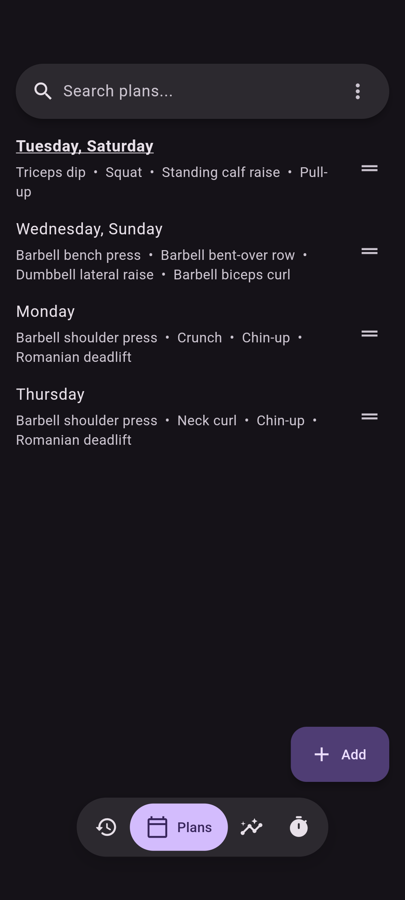
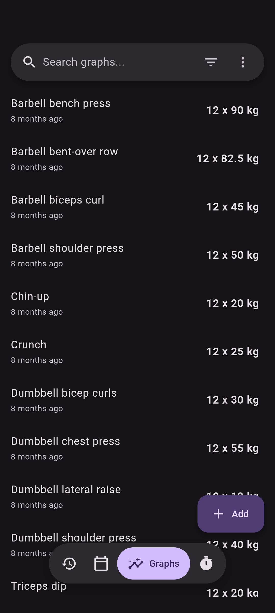
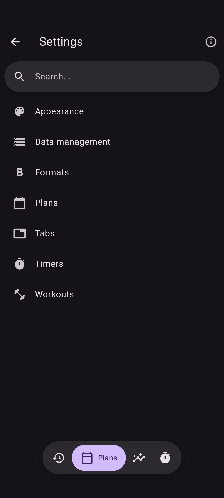
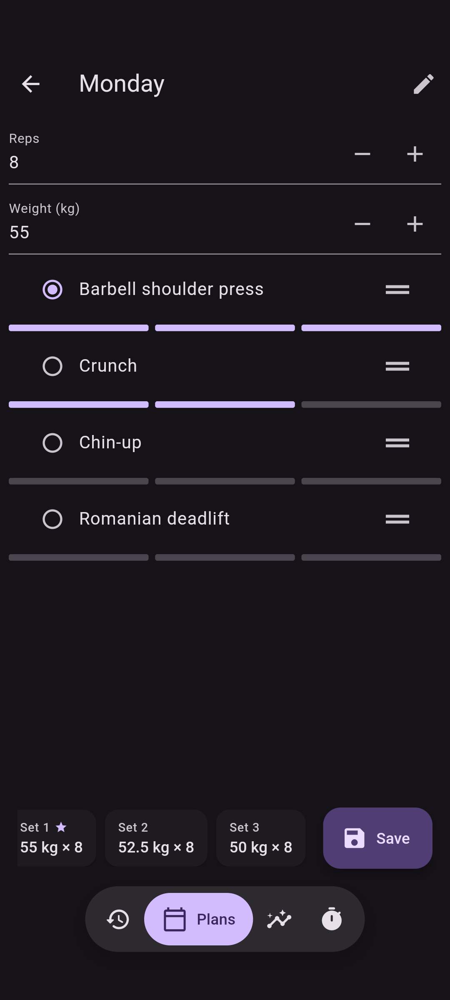
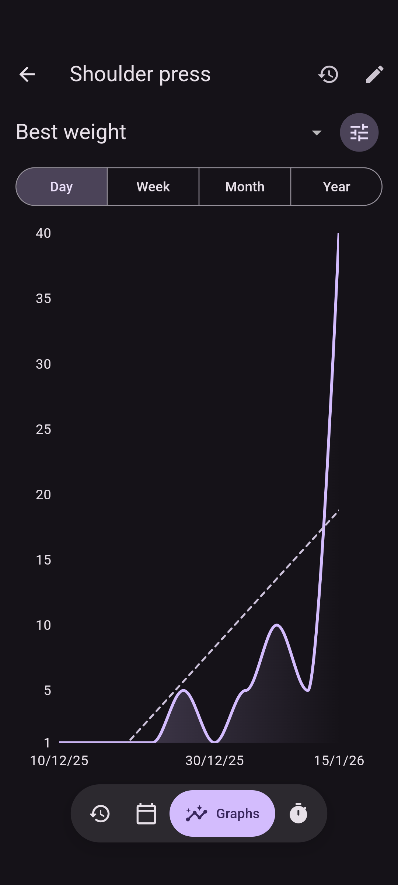
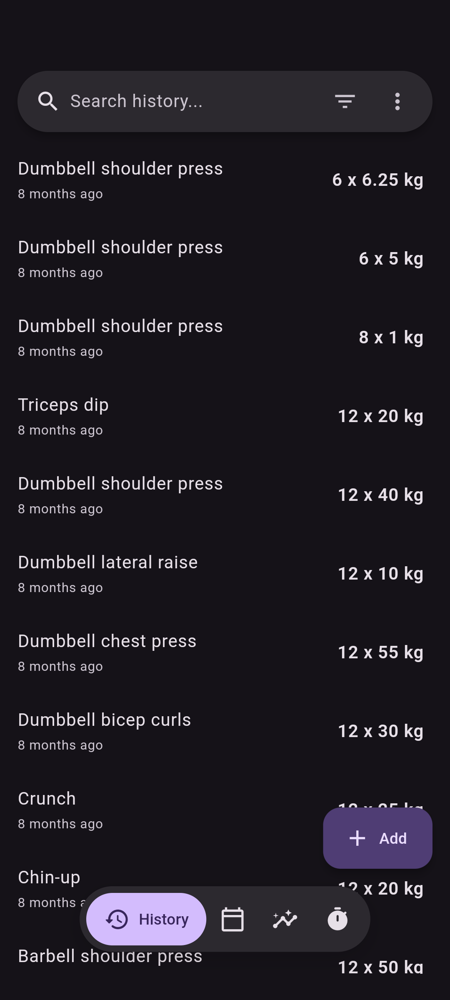
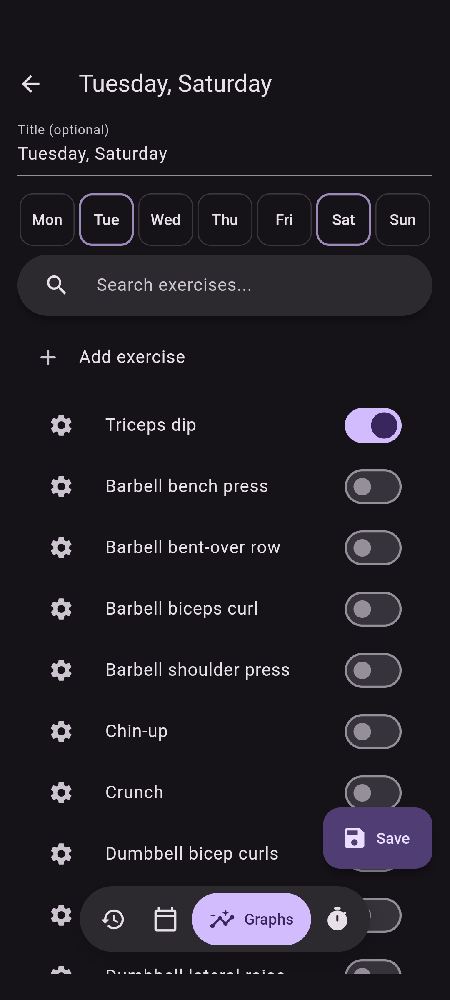
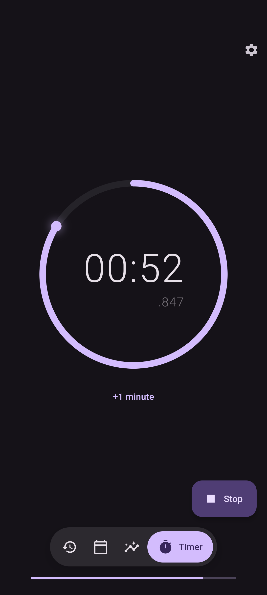

# Flexify

Track gym progress while flexing on people.

<p float="left">
    <a href="https://github.com/brandonp2412/Flexify/releases/latest"></a>
    <a href="https://shields.io/badges/git-hub-downloads-all-assets-all-releases"></a>
</p>

## Features

- 💪 **Strength**: Log your reps and weights with ease.
- 📵 **Offline**: Flexify doesn't use the internet at all.
- 📈 **Graphs**: Visualize your progress over time with intuitive graphs.
- 🏃 **Cardio**: Record your progress with cardio types.
- ⏱️ **Timers**: Stay focused with alarms after resting.
- ⚙️ **Custom**: Toggle features on/off and swap between light/dark theme.

<a href="https://play.google.com/store/apps/details?id=com.presley.flexify"></a>
<a href="https://f-droid.org/packages/com.presley.flexify"></a>
<a href="https://apps.microsoft.com/detail/Flexify/9P13THVK7F69?mode=direct"></a>

## Screenshots

<p float="left">
    
    
    
    
    
    
    
    
</p>

## Donations

Contributing to Flexify is directly correlated with Gains
- Bitcoin `bc1qzlte8featxzf7xvtp3rjv7qqtwkgpup8hu85gp`
- Monero (XMR) `85tmLfWKbpd8nxQnUY878DDuFjmfcoCFXPWR7XYKLHBSbDZV8wxgoKYUtHtq1kHWJg4m14sdBXhYuUSbxEDA29d19XuREL5`
- [GitHub sponsor](https://github.com/sponsors/brandonp2412)

## Getting Started

To get started with Flexify, follow these steps:

1. **Clone the Repository**: Clone the Flexify repository to your local machine using Git:

   ```bash
   git clone --recursive https://github.com/brandonp2412/Flexify flexify
   ```

2. **Install Dependencies**: Navigate to the project directory and install the necessary dependencies:

   ```bash
   cd flexify
   flutter pub get
   ```

3. **Run the App**: Launch the Flexify app on your preferred device or emulator:

   ```bash
   flutter run
   ```

## License

Flexify is licensed under the [MIT License](LICENSE.md).
