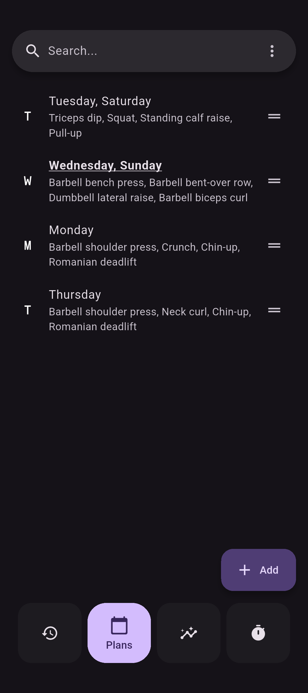
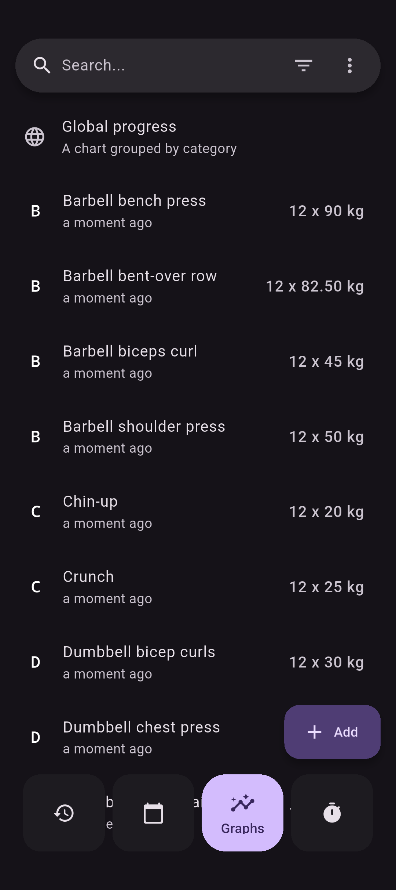
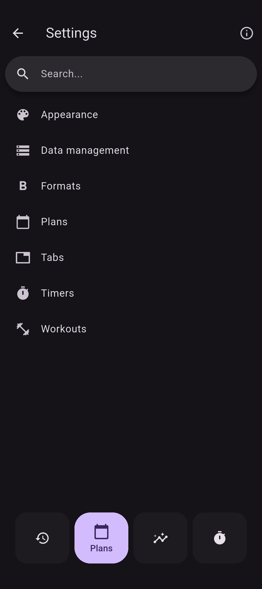
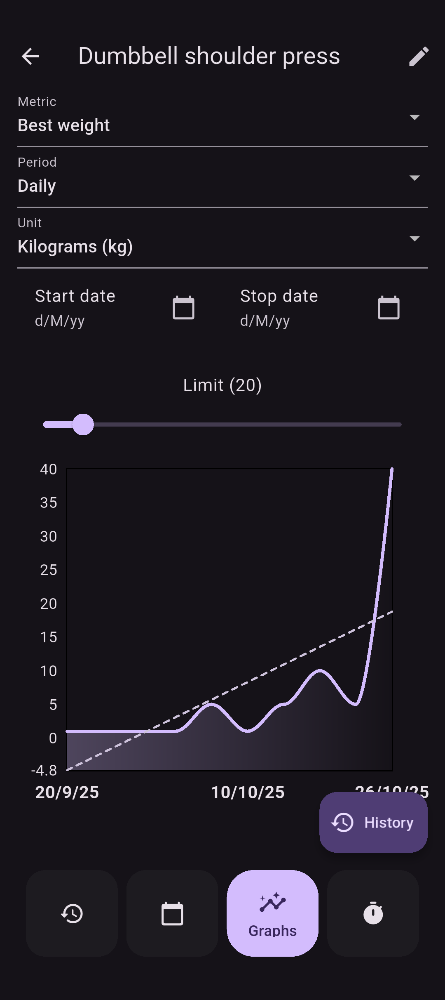
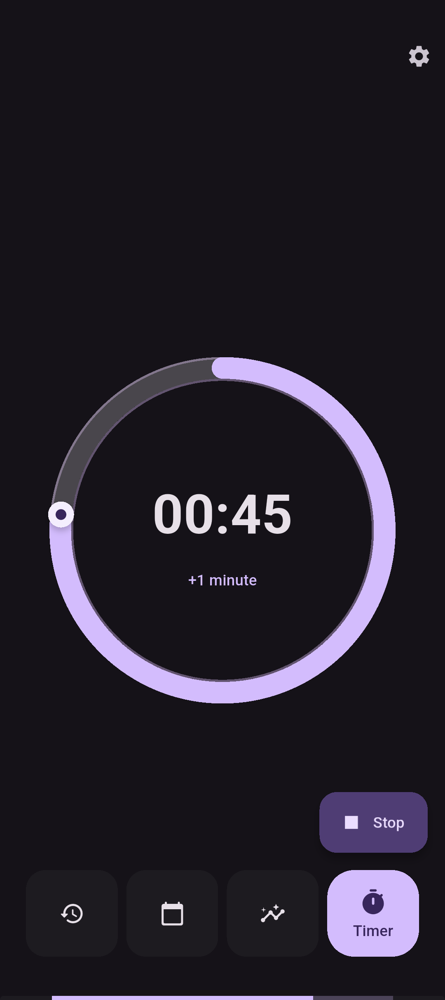

# Flexify

Flex on people with this swanky, lightning-quick gym tracker!

<p float="left">
    <a href="https://github.com/brandonp2412/Flexify/releases/latest"></a>
    <a href="#"></a>
</p>

## Features

- 💪 **Strength**: Log your reps and weights with ease.
- 📵 **Offline**: Flexify doesn't use the internet at all.
- 📈 **Graphs**: Visualize your progress over time with intuitive graphs.
- 🏃 **Cardio**: Record your progress with cardio types.
- ⚙️ **Custom**: Toggle features on/off, swap between light/dark theme and much more.
- ⏱️ **Timers**: Stay focused with alarms after resting.

<a href='https://play.google.com/store/apps/details?id=com.presley.flexify'></a>
<a href="https://f-droid.org/packages/com.presley.flexify"></a>

<a href="https://apps.microsoft.com/detail/Flexify/9P13THVK7F69?mode=direct"></a>
<a href="https://apps.apple.com/us/app/flexify/id6503730178?itsct=apps_box_badge&amp;itscg=30200"></a>

## Screenshots

<p float="left">
    
    
    
    
    
    
    
    
</p>

## Migration from [Massive](https://github.com/brandonp2412/Massive)

Gym sets and plans can be imported into Flexify.

<p float="left">
    
    
</p>

## Donations

If you would like to support this project:

- Bitcoin `bc1qzlte8featxzf7xvtp3rjv7qqtwkgpup8hu85gp`
- Monero (XMR) `85tmLfWKbpd8nxQnUY878DDuFjmfcoCFXPWR7XYKLHBSbDZV8wxgoKYUtHtq1kHWJg4m14sdBXhYuUSbxEDA29d19XuREL5`
- [GitHub sponsor](https://github.com/sponsors/brandonp2412)

## Getting Started

To get started with Flexify, follow these steps:

1. **Clone the Repository**: Clone the Flexify repository to your local machine using Git:

   ```bash
   git clone --recursive https://github.com/brandonp2412/Flexify flexify
   ```

2. **Install Dependencies**: Navigate to the project directory and install the necessary dependencies:

   ```bash
   cd flexify
   flutter pub get
   ```

3. **Run the App**: Launch the Flexify app on your preferred device or emulator:

   ```bash
   flutter run
   ```

## Migrations

If you edit any of the models in the `lib/database` directory you probably need to create migrations. E.g. assume the version starts at `1`.

1. Bump the `schemaVersion`
   `lib/database/database.dart`

```dart
  int get schemaVersion => 2;
```

2. Run database migrations

```sh
./scripts/migrate.sh
```

3. Add the migration step
   `lib/database/database.dart`

```dart
from1To2: (Migrator m, Schema2 schema) async {
  await m.addColumn(schema.myTable, schema.myTable.myColumn);
},
```

## Contributing

All issues and pull requests are welcome. We don't care what style it's in, we don't care what your variable names are.

## License

Flexify is licensed under the [MIT License](LICENSE.md).
